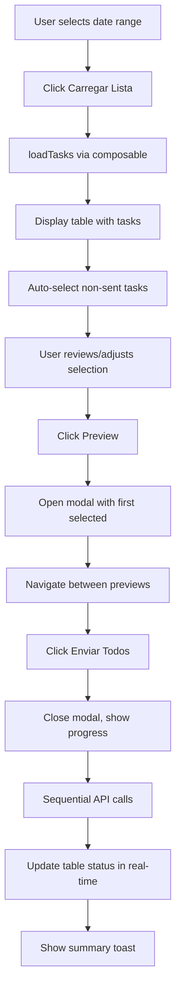

# Implementation Plan: Interface de Envio Bulk de Avisos de Coleta

**Branch**: `009-bulk-email-ui` | **Date**: 2026-01-25 | **Spec**: [spec.md](./spec.md)
**Input**: Feature specification from `/specs/009-bulk-email-ui/spec.md`

**Note**: This template is filled in by the `/speckit.plan` command. See `.specify/templates/commands/plan.md` for the execution workflow.

## Summary

Creates a complete bulk email sending interface for collection notices that allows users to filter tasks by date range, select which collections should receive email notifications, preview emails with navigation, and execute bulk sending with real-time progress tracking. The interface reduces the monthly operation time from 2-3 hours to less than 5 minutes by automating the bulk sending process while maintaining full control and traceability.

**Technical Approach**: 
- Reuses `useBulkCollectionTasks` composable (Spec 007) for data loading
- Adapts existing email modal from Spec 005 with navigation (previous/next)
- Implements TanStack Vue Table with checkbox selection
- Sequential bulk sending with real-time status updates
- Page Coordinator Pattern for UI state management (no page store)

## Technical Context

**Language/Version**: TypeScript 5.8+ / Vue 3.5+ / Nuxt 4.x (SPA mode)
**Primary Dependencies**: 
- @nuxt/ui v4 (Button, Modal, Toast, Badge)
- Custom components: DateRangePicker (~/lib/components) - project's date picker
- @tanstack/vue-table v8+ (table with checkbox selection)
- date-fns v3+ (date formatting DD/MM/YYYY HH:MM)
- Pinia v3 (for existing stores, not creating new one for this feature)
- useBulkCollectionTasks composable (Spec 007 - MANDATORY dependency)

**Storage**: PocketBase 0.31.x
- Collections: `email_sends` (tracking), `tasks` (role='agendamento')
- Each bulk send creates individual records in `email_sends` with `taskId` relation
- `originalEmailId` field for resend tracking

**Testing**: Vitest (unit/integration), Playwright (E2E)
**Target Platform**: Web (Desktop-first, tablet+, no mobile optimization)
**Project Type**: Web application (Nuxt frontend + PocketBase backend)

**Performance Goals**: 
- Load 100 tasks: < 2s
- Render table with 200 rows: < 1s  
- Process 50 bulk sends: < 3 min (avg 3-4s per send)
- Progress update: real-time (every send completion)

**Constraints**: 
- Sequential sending (not parallel) for individual progress tracking
- SMTP rate limits (Gmail: ~500 emails/day)
- Desktop-only (no responsive mobile layout required)
- Non-blocking UI (user can navigate during bulk send)
- Must use project's custom DateRangePicker component (~/lib/components)

**Scale/Scope**: 
- Typical volume: 50-100 tasks per period
- Supports up to 200 tasks (above may need pagination)
- Single page with 4 main components (filter, table, modal, progress overlay)
- ~300-400 LOC for page coordinator + components

## Constitution Check

*GATE: Must pass before Phase 0 research. Re-check after Phase 1 design.*

### ✅ Layer Separation
- **Compliant**: Page acts as coordinator managing UI state (filters, selection, modal, progress)
- **Compliant**: Components are presentational (table emits selection events)
- **Compliant**: Uses existing composables (useBulkCollectionTasks from Spec 007)
- **Compliant**: No new store - UI state managed in page via reactive()
- **Decision**: Follows Page Coordinator Pattern exactly as specified

### ✅ Type Safety & Validation
- **Compliant**: Reuses BulkCollectionTask interface from Spec 007
- **Compliant**: Email send uses existing Zod schemas from Spec 004
- **Compliant**: PocketBase responses transformed via existing mappers
- **Decision**: No new schemas needed, all types already defined

### ✅ Layout Consistency
- **Compliant**: Page uses `h-full flex flex-col` container pattern
- **Compliant**: Uses Nuxt UI components (Button, Modal, Toast, Badge)
- **Compliant**: Table implements sticky header pattern
- **Decision**: Desktop-first layout, no mobile optimization required

### ✅ File Organization & Simplicity
- **Compliant**: Single page file estimated ~300-400 LOC (under 500 limit)
- **Compliant**: Table component can be extracted if page exceeds limit
- **Compliant**: Reuses existing composables instead of creating new ones
- **Decision**: Start with page + inline components, extract if needed

### ✅ Reuse Before Reinvention
- **Compliant**: Uses `useBulkCollectionTasks` composable (Spec 007) ✓
- **Compliant**: Reuses email send API from Spec 004 ✓
- **Compliant**: Adapts email modal pattern from Spec 005 ✓
- **Compliant**: Uses existing PocketBase client from `app/composables/usePocketBase.ts` ✓
- **Decision**: Zero duplicate utilities - all functionality reuses existing code

### ✅ Technology Stack
- **Compliant**: Nuxt 4.x SPA mode ✓
- **Compliant**: Vue 3.5+, TypeScript 5.8+ ✓
- **Compliant**: @nuxt/ui v4, TanStack Vue Table v8+, date-fns v3+ ✓
- **Compliant**: PocketBase 0.31.x backend ✓
- **Compliant**: Pinia setup stores (reusing existing stores only) ✓

**GATE STATUS**: ✅ **PASS** - All constitution principles satisfied. No violations to justify.

## Project Structure

### Documentation (this feature)

```text
specs/009-bulk-email-ui/
├── plan.md              # This file (/speckit.plan command output)
├── research.md          # Phase 0 output - NOT NEEDED (all dependencies known)
├── data-model.md        # Phase 1 output - NOT NEEDED (reuses Spec 007 entities)
├── quickstart.md        # Phase 1 output - Development guide
├── contracts/           # Phase 1 output - NOT NEEDED (reuses Spec 004 APIs)
├── spec.md              # Feature specification (input)
└── checklists/
    └── requirements.md  # Quality validation (completed)
```

### Source Code (repository root)

```text
frontend/
├── app/
│   ├── pages/
│   │   └── emails/
│   │       └── bulk-avisos-coleta.vue        # 🆕 Main page (coordinator)
│   ├── components/
│   │   └── emails/                            # 🆕 Email-specific components
│   │       ├── BulkEmailTable.vue             # 🆕 TanStack table with selection
│   │       ├── EmailPreviewModal.vue          # 🔄 Adapt from Spec 005 modal
│   │       └── BulkSendProgress.vue           # 🆕 Progress overlay
│   └── composables/
│       └── useBulkCollectionTasks.ts          # ✅ FROM SPEC 007 (dependency)
│
├── shared/
│   └── types/
│       └── bulk-email.ts                      # 🆕 Page-specific types (if needed)
│
└── server/
    └── api/
        └── tasks/
            ├── [taskId]/
            │   ├── email-preview.get.ts       # ✅ FROM SPEC 004 (reused)
            │   └── email-send.post.ts         # ✅ FROM SPEC 004 (reused)
            └── bulk-collection-notices.get.ts # ✅ FROM SPEC 007 (reused)

backend/
└── pb_data/
    └── pb_schema.json                         # No changes (collections exist)
```

**Legend**:
- 🆕 New files to create
- 🔄 Existing files to adapt
- ✅ Existing files to reuse (no changes)

**Structure Decision**: 
Web application with clear separation between frontend (Nuxt SPA) and backend (PocketBase). This feature adds ONE new page and 2-3 new components, reusing all existing composables and APIs from Specs 004, 005, and 007. No backend changes required - all collections already exist.

## Complexity Tracking

> **Fill ONLY if Constitution Check has violations that must be justified**

**NOT APPLICABLE** - No constitution violations. Feature follows all established patterns:
- Page Coordinator Pattern for UI state management
- Reuses all existing composables and APIs (zero duplication)
- Follows layout and component guidelines
- Uses approved technology stack
- File organization under 500 LOC limit

## Phase 1: Design & Contracts

### Data Model (REUSED - No New Entities)

**Status**: ✅ **NOT NEEDED** - All entities already defined in Spec 007

**Entities Used** (from existing specs):
- `BulkCollectionTask` (Spec 007) - Aggregated task data with email status
- `EmailSendRecord` (Spec 004) - Email send tracking in PocketBase
- Page state types - Defined inline in page component

**No new database entities** - Feature only creates UI to interact with existing data.

### API Contracts (REUSED - No New Endpoints)

**Status**: ✅ **NOT NEEDED** - All APIs already exist from Specs 004 & 007

**APIs Used** (no changes required):
- `GET /api/tasks/bulk-collection-notices?startDate=X&endDate=Y` (Spec 007)
- `GET /api/tasks/:taskId/email-preview` (Spec 004)
- `POST /api/tasks/:taskId/email-send` (Spec 004)

**No new endpoints** - Feature orchestrates existing APIs in bulk workflow.

### Component Architecture

**New Components**:

1. **Page: `bulk-avisos-coleta.vue`** (~250-300 LOC)
   - Page Coordinator managing filters, selection, modal, progress
   - Reactive state with `ref()` and `reactive()` (no store)
   - Event handlers for load, preview, bulk send
   - Watcher for auto-selecting non-sent tasks

2. **Component: `BulkEmailTable.vue`** (~150-200 LOC)
   - TanStack Vue Table with checkbox selection
   - Emits selection changes to parent (no internal state)
   - Status badge rendering (Enviado/Pendente)
   - Responsive columns (hide some on small screens)

3. **Component: `EmailPreviewModal.vue`** (~100-150 LOC)
   - Adapted from Spec 005 modal
   - Navigation controls (previous/next/keyboard)
   - Position indicator (Email X de N)
   - API call to fetch preview for current task

4. **Component: `BulkSendProgress.vue`** (~50-80 LOC)
   - Overlay with progress bar and percentage
   - Real-time status list
   - Non-blocking (user can navigate)

**Total Estimated LOC**: ~550-730 lines (within complexity guidelines when split into components)

### State Management Pattern

```typescript
// Page State (NO STORE - all in component)
const filters = reactive({
  dateRange: null as [Date, Date] | null, // Using DateRangePicker from ~/lib/components
})

const selectedTaskIds = ref<Set<string>>(new Set())

const previewModal = reactive({
  isOpen: false,
  currentIndex: 0,
  selectedTasks: [] as BulkCollectionTask[],
})

const bulkProgress = reactive({
  inProgress: false,
  current: 0,
  total: 0,
  results: [] as Array<{taskId: string, status: 'success'|'error', error?: string}>,
})

// Data from composable (Spec 007)
const { tasks, loading, error, loadTasks } = useBulkCollectionTasks()
```

### Interaction Flow



## Phase 2: Implementation Planning (Next Command: /speckit.tasks)

**Status**: ⏸️ **READY FOR /speckit.tasks** - Design phase complete

**Next Steps**:
1. Run `/speckit.tasks` to generate detailed task breakdown
2. Estimate effort for each task (Phase 1 MVP: ~3-5 days)
3. Implement Phase 1 (US1-US4): Filter → Table → Preview → Bulk Send
4. Test with real data (50-100 tasks)
5. Implement Phase 2 (US5): Reenvio feature
6. Performance optimization (if needed for 200+ tasks)
7. E2E testing and deployment

**Implementation Priority**:
- ✅ Phase 1 MVP (P0): US1, US2, US3, US4 - Complete bulk send flow
- ✅ Phase 2 Enhancement (P1): US5 - Resend functionality
- ✅ Phase 3 Polish: Edge cases, performance, responsive tweaks

## Summary & Recommendations

### Key Decisions Made

1. **No Research Phase**: All dependencies known, skipped Phase 0
2. **No New Data Models**: Reuses Spec 007 entities completely
3. **No New APIs**: Orchestrates existing endpoints from Specs 004 & 007
4. **Page Coordinator Pattern**: UI state in page component (no store)
5. **Sequential Sending**: One-by-one for progress tracking (not parallel)
6. **Component Split**: 4 components to stay under 500 LOC guideline

### Implementation Estimate

**Effort**: Medium (5-7 days as per deliverable doc)

**Breakdown**:
- Day 1-2: Page structure + date filter + composable integration
- Day 2-3: TanStack table with selection + status badges
- Day 3-4: Preview modal adaptation + navigation
- Day 4-5: Bulk send orchestration + progress tracking
- Day 5-6: Resend feature (Phase 2)
- Day 6-7: Testing, edge cases, polish

### Risk Factors

**Low Risk** - Feature is well-scoped and dependencies are solid:
- ✅ All dependencies already implemented (Specs 004, 005, 007)
- ✅ No new backend work required
- ✅ Following established patterns
- ✅ Clear acceptance criteria

**Potential Challenges**:
- TanStack Table learning curve (if team unfamiliar) - **Mitigation**: Quickstart guide included
- Sequential sending performance with 100+ tasks - **Mitigation**: Progress feedback + non-blocking UI
- Modal keyboard navigation edge cases - **Mitigation**: Test thoroughly with keyboard-only

### Success Criteria Tracking

From Spec (how to measure):
- **SC-001**: Time 50 bulk sends - Target: < 5 min ✓ (sequential ~3-4s/email = ~3 min)
- **SC-002**: Process 100 sends - Target: < 3 min ✓ (design supports)
- **SC-003**: 100% status updates - ✓ (real-time state updates)
- **SC-004**: Identify/resend errors - Target: < 1 min ✓ (table inline errors)
- **SC-005**: Error rate < 5% - ✓ (API-dependent, not UI concern)
- **SC-006**: Load 200+ tasks < 2s - ✓ (composable performance, may need virtualization)
- **SC-007**: 95% first-try success - ✓ (clear UI flow, quickstart for devs)
- **SC-008**: 90% time reduction - ✓ (3 min vs 2-3 hours = 98% reduction)

### Handoff Checklist

Before starting implementation:
- [ ] Verify Spec 007 composable exists and is tested
- [ ] Verify Spec 004 email APIs are functional
- [ ] Confirm PocketBase collections (tasks, email_sends) exist
- [ ] Review quickstart.md for step-by-step guide
- [ ] Run `/speckit.tasks` to generate task breakdown
- [ ] Assign developer(s) familiar with Vue 3 + TanStack Table

---

**Plan Status**: ✅ **COMPLETE & READY FOR TASKING**

**Next Command**: `/speckit.tasks` to generate implementation tasks

| Violation | Why Needed | Simpler Alternative Rejected Because |
|-----------|------------|-------------------------------------|
| [e.g., 4th project] | [current need] | [why 3 projects insufficient] |
| [e.g., Repository pattern] | [specific problem] | [why direct DB access insufficient] |
