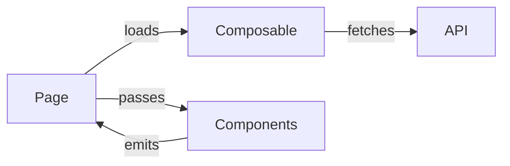

## User Input

```text
$ARGUMENTS
```

You **MUST** consider the user input before proceeding (if not empty).

## Goal

Generate a comprehensive technical plan (`plan.md`) that combines the deliverable requirements with the discovered project context. This document makes all architectural decisions explicit.

## Operating Constraints

**ARCHITECT ROLE**: Act as a Solutions Architect making technical decisions.

**CONTEXT-DRIVEN**: All decisions must reference findings from `context.md`.

**EXPLICIT DECISIONS**: No ambiguity - every technical choice must be documented.

## Pre-Flight Check: Context Required

1. Identify the spec directory from $ARGUMENTS
2. Verify `specs/[XXX]-[name]/context.md` exists
3. If not found:
   ```
   ⚠️ Context Not Generated
   
   Could not find context.md for: [input]
   
   → Run @prd-context first to analyze the project.
   ```

## Execution Steps

1. **Parse Input**: Extract spec directory from $ARGUMENTS

2. **Load Inputs**:
   - Read `specs/[XXX]/deliverable.md` - User stories, acceptance criteria
   - Read `specs/[XXX]/context.md` - Project patterns, stack, skills

3. **For Each User Story**:
   - Identify what technical components are needed
   - Map to existing patterns from context
   - Note what needs to be created vs reused

4. **Make Architectural Decisions**:
   - Routing/URL structure
   - Component hierarchy
   - State management approach
   - Data flow
   - API contracts

5. **Generate plan.md**: Create `specs/[XXX]/plan.md`

## Output Format: plan.md

```markdown
# Plan: [Feature Name]

**Generated**: [timestamp]
**Deliverable**: [link]
**Context**: [link]

---

## Technical Summary

| Aspect | Decision |
|--------|----------|
| Route | `/path/to/page` |
| Components | [N] new in `components/[Feature]/` |
| Composables | [Reuse X] / [Create Y] |
| State | Page-level / Store |
| API Changes | None / [describe] |

---

## Architecture

### Component Tree

```
Page: pages/[path].vue (Coordinator)
├── [Feature]Filter.vue (inline or component)
├── [Feature]Table.vue
│   ├── Uses: TanStack Vue Table
│   └── Pattern: components/Tasks/Table.vue
├── [Feature]Modal.vue
│   └── Pattern: components/Email/PreviewModal.vue
└── [Feature]Progress.vue
```

### Data Flow



---

## Layer Breakdown

### Layer 0: Types & Interfaces

**Location**: `shared/types/[feature].ts` or inline

| Type | Purpose |
|------|---------|
| `[Type1]` | [description] |
| `[Type2]` | [description] |

### Layer 1: Backend (if applicable)

**Location**: `server/api/[feature]/`

| Endpoint | Method | Purpose |
|----------|--------|---------|
| `/api/[path]` | GET | [description] |
| `/api/[path]` | POST | [description] |

### Layer 2: Data Layer

**Location**: `composables/use[Feature].ts`

| Composable | Reuse | Purpose |
|------------|-------|---------|
| `use[X]()` | Existing | [why reuse] |
| `use[Y]()` | New | [what it does] |

### Layer 3: UI Components

**Location**: `components/[Feature]/`

| Component | Pattern From | Key Props |
|-----------|--------------|-----------|
| `Table.vue` | Tasks/Table.vue | items, loading, onSelect |
| `Modal.vue` | Email/PreviewModal.vue | isOpen, data |

### Layer 4: Page Integration

**Location**: `pages/[path].vue`

| Responsibility | Implementation |
|----------------|----------------|
| State coordination | Page refs, no store |
| Data loading | Via composable |
| Event handling | Component emits → page methods |

### Layer 5: Polish

| Item | Approach |
|------|----------|
| Error handling | try/catch with toast |
| Loading states | Overlay pattern |
| Edge cases | [list] |

---

## Skills to Read Before Implementation

| Layer | Skill | Sections |
|-------|-------|----------|
| 3 | tanstack-table | Row selection, FlexRender |
| 3 | nuxt-ui | UModal, UButton, UTable |
| 4 | - | pages.list-coordinator.instructions.md |

---

## Acceptance Criteria Mapping

| AC | Layer | Implementation |
|----|-------|----------------|
| AC1: Filter by date | L4 | DateRangePicker + composable |
| AC2: Table selection | L3 | TanStack row selection |
| AC3: Preview modal | L3 | Modal with navigation |

---

## Open Decisions

- [Any decisions that need user input]
```

## Command Output

```
📐 Plan Generated

**Feature**: [XXX]-[feature-name]
**File**: specs/[XXX]-[feature-name]/plan.md

**Architecture**:
- [N] layers defined
- [N] components planned
- [N] skills to reference

**Acceptance Criteria**: All [N] mapped to implementation

**Next Step**: Run @prd-tasks to generate implementation tasks.
```

## Context

{ARGS}
